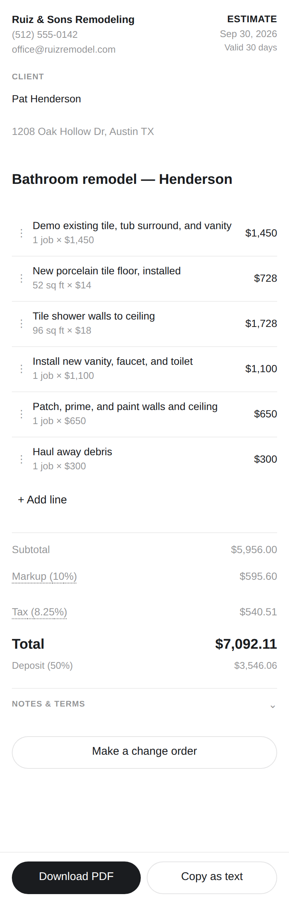
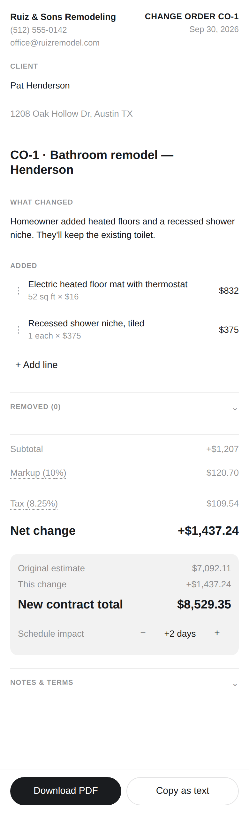
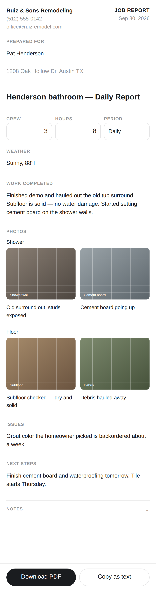

# JobPaper

**ChatGPT plugin that turns a contractor's notes and photos into estimates, change orders, and job reports you can send as a PDF.**

Say "write up an estimate for a bathroom remodel…", "change order — they added a heated floor", or "end of day report for the Henderson job". JobPaper opens the document as a panel that looks like the PDF the customer gets. Tap any line to fix it → **Download PDF** or **Copy as text**.

| Estimate | Change order | Job report |
| --- | --- | --- |
|  |  |  |

Sample PDFs: [estimate](docs/samples/estimate.pdf) · [change order](docs/samples/change_order.pdf) · [job report](docs/samples/job_report.pdf)

## How it works

```
ChatGPT model ──drafts line items──▶ create_estimate / create_change_order / create_job_report
                                        │  (MCP server, stateless: computes totals from settings)
                                        ▼
            document JSON + resource link (jobpaper://doc/<name>.est.json?d=…)
                                        │
                                        ▼
        Panel (ui://jobpaper/document-v1, one self-contained HTML file)
          • tap-to-edit lines, totals recompute (same shared math as the server)
          • PDF built on the device (jsPDF) → ui/download-file
          • edits → ui/update-model-context (model always sees current totals)
          • opened from a file → openai/resources/write saves edits back
```

- **No database for documents.** A document travels as a small JSON file in the chat. When it can't be a host file, it lives inside its own `jobpaper://` URI, which the server decodes — so a change order can read the original estimate weeks later with no storage.
- **The only server-side state is business settings** (name, phone, email, logo, markup, tax, terms), keyed by a SHA-256 hash of ChatGPT's anonymized `openai/subject`. Upstash Redis / Vercel KV over REST; in-memory when not configured.
- **The model never does math.** `src/shared/totals.ts` computes subtotal → markup → tax → total, used by both the server and the panel.

### Tools

| Tool | Visible to | Purpose |
| --- | --- | --- |
| `create_estimate` | model | Estimate from a description + drafted lines |
| `create_change_order` | model | CO against a saved estimate (or the latest CO) file; CO-1, CO-2… |
| `create_job_report` | model | Daily/weekly report with photo grid and captions |
| `open_jobpaper` | entrypoints | Sidebar (global) and thread tab: start a document, open a saved file |
| `open_document_file` | entrypoint | File viewer for `.est.json`, `.co.json`, `.rpt.json` |
| `settings.read` / `settings.update` | host | Structured plugin settings |
| `edit_logo` | settings button | Logo upload panel |
| `save_logo`, `get_settings` | panel only | Helpers |

All three document tools are `readOnlyHint: true, destructiveHint: false, openWorldHint: false` — they only return a document.

## Develop

Requires Node 22+.

```sh
npm install
npm run build          # panel → dist/app/index.html, embedded into the server; server → dist/server.mjs
npm test               # unit + MCP integration + end-to-end (fake ChatGPT host drives the real panel)
npm run dev            # local server on http://localhost:8787/mcp (JOBPAPER_DEV_USER=dev)
npm run preview        # panel alone with sample documents (?demo=estimate|change_order|job_report|home|logo&mode=inline&theme=dark)
npm run screenshots    # docs/screenshots + public/screenshots
npm run pdf-samples    # docs/samples/*.pdf
```

### Connect to ChatGPT (developer mode)

1. `npm run dev`, then expose it: `npx cloudflared tunnel --url http://localhost:8787` (or ngrok).
2. ChatGPT → Settings → Apps & Connectors → Advanced → Developer mode on.
3. Create a connector with URL `https://<tunnel>/mcp`, no auth.
4. In a chat: "write up an estimate for a 6 ft cedar fence, 120 ft, for the Lees".

### Deploy

**Vercel (default):** import the repo; it runs `npm run build:app`, serves `public/` (landing, privacy, terms, support) and `api/mcp.ts` at `/mcp`. Add an Upstash Redis integration (sets `KV_REST_API_URL` / `KV_REST_API_TOKEN`).

**Cloudflare Workers:** `npm run build:app && npx wrangler deploy`, then set the two KV secrets.

See [.env.example](.env.example).

## Layout

```
src/shared/   document model, totals, builders, normalizers, file/URI codec, SMS text
src/server/   MCP server (tools, settings, resources), HTTP handler, Node/Vercel/Workers entries
src/app/      panel: React + Tailwind, PDF, photos, host bridge
skills/       jobpaper (when/how to use the tools), setup (onboarding)
public/       landing, privacy, terms, support pages
docs/         submission package, test plan, decisions, screenshots, sample PDFs
test/         unit, server integration, e2e (test/e2e/host.ts is the fake ChatGPT)
```

## Docs

- [docs/SUBMISSION.md](docs/SUBMISSION.md) — everything to paste into the OpenAI submission, plus the checklist
- [docs/TESTING.md](docs/TESTING.md) — manual test plan for real devices
- [docs/DECISIONS.md](docs/DECISIONS.md) — how the build differs from the v1 spec, and the day-1 platform checks
